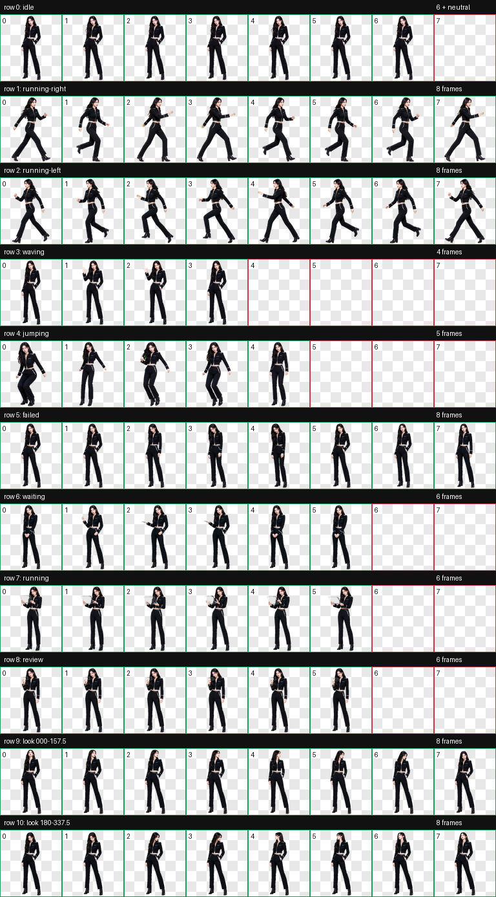

# Karina Realistic Codex Pet

`karina-realistic` 是一套非官方、非商业的真人写实粉丝创作 Codex Pet。角色设计参考 KARINA 的公开官方资料与编辑报道所呈现的舞台视觉语言，但不复制任何具体照片、品牌服装、Logo 或水印。



## 交付规格

- Codex Pet v2：`spriteVersionNumber: 2`
- 图集：透明 RGBA WebP，`1536×2288`
- 网格：8 列 × 11 行；单元格 `192×208`
- 标准状态：`idle`、`running-right`、`running-left`、`waving`、`jumping`、`failed`、`waiting`、`running`、`review`
- 注视方向：16 个顺时针方向，从 `000°` 到 `337.5°`，每步 `22.5°`
- 左右跑动分别完整生成；未以镜像代替人物与服装一致性检查

## 视觉设计

稳定设计语言为：成年女性舞台表演者、自然黑至深棕长发、冷调清晰眼妆、无品牌黑色剪裁短夹克与长裤、窄银色结构线、黑色短靴和少量冰蓝点缀。动作保持真人比例、真实重心和克制的舞台控制；等待、挥手等状态使用更温和的表情。

研究共记录 9 个公开来源，其中 3 个为 SM Entertainment/aespa 官方来源。研究结论、事实与设计推断的边界，以及明确排除项，见 [视觉研究](research/karina-visual-research.md) 和 [结构化来源](research/sources.json)。仓库未保存或重新分发任何第三方照片。

## QA

确定性检查已确认图集为 RGBA WebP、8×11、v2，透明 RGB 残留为 0；最终去色处理保留 alpha。三位全新隔离评审仅查看随机 A/B 盲测图，`000/180` 与 `090/270` 两组方向硬门禁全部通过。中间方向的细微轴向分歧保留为可审计警告，并由标注方向图与完整环路连续性复核判定为轻微问题。

- [最终验证](final/validation.json)
- [方向语义](qa/direction-semantics.json)
- [盲测验证](qa/direction-blind-validation.json)
- [盲测处置](qa/blind-review-resolution.json)
- [连续性报告](qa/look-continuity.json)
- [最终视觉复核](qa/review.json)
- [方向总览](qa/look-directions.png)
- [动画预览](qa/previews/)

## 安装

复制 `package/karina-realistic` 到 Codex pets 目录：

```bash
cp -R package/karina-realistic ~/.codex/pets/karina-realistic
```

安装目录必须只包含 `pet.json` 和 `spritesheet.webp`。本次构建已在本机安装并通过文件清单、JSON、图集读取与 SHA-256 一致性检查；未修改 Codex 全局配置。

## 声明

这是原创生成的非官方粉丝作品，不代表 KARINA、aespa、SM Entertainment 或任何资料出版方的认可或授权。姓名、团体名与相关识别仅用于描述创作主题；请勿将本包用于误导性背书、冒充官方发布或重新分发第三方摄影素材。
